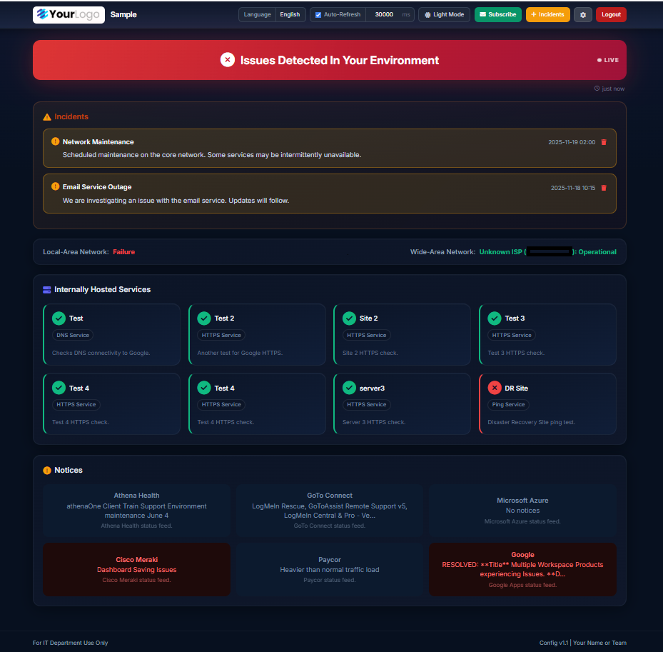

# Simple Status Page

A sleek, production-ready status page built with Next.js, TypeScript, Tailwind CSS, and SQLite. Real-time service monitoring, incident management, outage history, email subscriptions, RSS feed integration, and full branding customization, all configurable from an in-browser admin UI.

## Screenshot



## Features

**Monitoring**
- Real-time checks for internal services: real HTTP(S) requests (status-code validated) for services typed HTTP/HTTPS, a real DNS query for services typed DNS, raw TCP port checks for everything else, and ICMP ping when no port is set
- Checks run in parallel and are shared between the live status page and the background notifier, so there's a single source of truth for uptime history
- Local-area (gateway ping) and wide-area (real DNS query to a public resolver) network status
- Live pulsing **LIVE** indicator on the status banner

**Service Cards**
- Hover tooltip shows hostname, port number, last offline time, and outage duration
- Live downtime counter on any card that is currently down (counts up in real time)
- Automatic downtime tracking, no separate cron setup required inside the container

**Outage History**
- Full log of every down→up cycle with service name, went-down time, recovered time, and duration
- Filter by service name
- Filter by time range: last hour, 8 hours, 24 hours, 7 days, 30 days

**Incident Management**
- Create incidents with title, description, severity, start time, and optional end time
- Severity levels: Degraded / Outage / Maintenance / Resolved
- Ongoing badge for incidents without an end time
- Admin-only create/remove; visible to all

**Notifications**
- Email subscriptions, users subscribe per service, with self-service manage/unsubscribe modals
- SMTP notifications via Nodemailer when a service changes state, including a service found down on its very first check
- One-click "Work in Progress" / "Mark Resolved" action links in outage emails that post an incident directly (no login needed)
- Optional browser push notifications and alert sound on status change
- Test Email button in Settings to verify SMTP configuration

**Admin UI** (`/admin`)
- Tabs: General, Services, RSS Feeds, Network, Notifications, SSL
- Add/remove/reorder services and RSS feeds (20 services max, 10 RSS feeds max)
- Logo upload, self-signed certificate generation plus custom certificate upload (hot-swapped into the running HTTPS listener when possible)
- Theme color pickers, announcement banner, SLA uptime badge computed from real outage history for the configured reporting period

**Other**
- RSS / Atom feed integration (displays latest item from external status feeds)
- Dark mode (cookie-persisted, toggle in navbar)
- Fully responsive: mobile, tablet, desktop
- CSRF protection on all forms, rate limiting on login/incident creation/subscription endpoints
- Single Docker container, SQLite storage, no external database to run

## Default Login

**Username:** `admin`
**Password:** `changeme`

Set via environment variables, or change `require_auth` in the General tab of the admin UI to disable login entirely.

## Quick Start

### Option 1: Docker (recommended)

```bash
docker run -d \
  --name simple-status-page \
  -p 80:3000 -p 443:3443 \
  -e APP_USERNAME="admin" \
  -e APP_PASSWORD="changeme" \
  -e AUTH_SECRET="$(openssl rand -hex 32)" \
  -v simple-status-page-data:/data \
  brandonsanders/simple-status-page
```

Open [http://localhost](http://localhost) (or `https://localhost` for the self-signed HTTPS listener).

### Option 2: Build from source

```bash
git clone https://github.com/BrandonSanders48/simple-status-page.git
cd simple-status-page
docker build -t simple-status-page -f dockerfile .
docker run -d -p 80:3000 -p 443:3443 \
  -e APP_USERNAME="admin" \
  -e APP_PASSWORD="changeme" \
  -e AUTH_SECRET="$(openssl rand -hex 32)" \
  -v simple-status-page-data:/data \
  simple-status-page
```

### Option 3: Local development

```bash
npm install
cp .env.example .env   # fill in AUTH_SECRET
npm run db:migrate
npm run dev
```

Requires Node.js 20+. `npm run dev` serves plain HTTP on [http://localhost:3000](http://localhost:3000) without the custom HTTPS listener.

## Configuration

Everything is configured through the in-browser admin UI at `/admin` (login required unless `require_auth` is disabled). There is no configuration file to hand-edit; all settings, services, RSS feeds, and network settings are stored in the SQLite database at `/data/app.db` inside the container.

### Services

Add each service with a name, host, port, type, and description from the Services tab. Leave port blank for ICMP ping instead of a port check. When `type` mentions "http" or "https" (case-insensitive), the service gets a real HTTP request with status-code validation instead of a raw TCP connect, so an app returning server errors is correctly reported as down even if its port still accepts connections. When `type` mentions "dns", the service gets a real UDP DNS query instead of a raw TCP connect, since most DNS servers don't listen on TCP at all. Maximum 20 services.

### RSS Feeds

Add a feed with a name, URL, format, and description from the RSS Feeds tab. Format is RSS or Atom. Maximum 10 feeds.

### Branding & Theme

Set business name, logo, company URL, support email, footer message, and theme colors (primary, accent, success, warning, error) from the General tab. The announcement banner shown on the public page is set from the Notifications tab, alongside alert sound and browser notification behaviour.

### Email Notifications (SMTP)

Set the from/reply-to addresses and SMTP host, port, security mode, username, and password from the Notifications tab, then use the Send Test button to confirm delivery. Notifications are sent automatically by a background job inside the app, no external cron setup required.

## Environment Variables

| Variable | Default | Description |
|---|---|---|
| `APP_USERNAME` | `admin` | Admin login username |
| `APP_PASSWORD` | `changeme` | Admin login password |
| `APP_AUTH_REQUIRED` | `true` | Set `false` to disable the login requirement entirely (overrides the in-app toggle) |
| `AUTH_SECRET` | *(required)* | Random secret used to sign session cookies. Generate with `openssl rand -hex 32` |
| `PAGE_URL` | *(company URL setting)* | Public base URL used to build links in notification emails |
| `DATA_DIR` | `/data` in Docker, `./data` locally | Where the SQLite database, uploads, and SSL certs are stored |
| `PORT` | `3000` | HTTP listener port |
| `HTTPS_PORT` | `3443` | HTTPS listener port (only starts once a certificate is present) |
